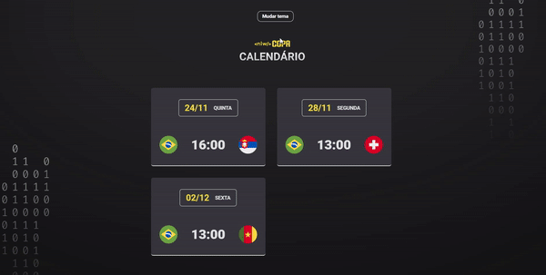

<h1 align="center"> NLW-copa </h1>

  Aplicação web para acompanhar a data e hora dos jogos da copa do Qatar 2022      

  <a href="#-tecnologias">Tecnologias</a>&nbsp;&nbsp;&nbsp;|&nbsp;&nbsp;&nbsp;
  <a href="#-projeto">Projeto</a>&nbsp;&nbsp;&nbsp;|&nbsp;&nbsp;&nbsp;
  <a href="#memo-licença">Licença</a>&nbsp;&nbsp;&nbsp;|&nbsp;&nbsp;&nbsp;
  <a href="#telephone_receiver-contato">Contato</a>

 

  

## 🚀 Tecnologias

Esse projeto foi desenvolvido com as seguintes tecnologias:

- HTML e CSS
- JavaScript e Cookies
- [Node e NPM](https://nodejs.org/)
- [Vite](https://vitejs.dev/)

## 💻 Projeto

A página NLW copa calendário é um projeto desenvolvido no evento Next Level Week da Rocketseat, onde seu principal objetivo é mostrar os jogos da copa do mundo. A aplicação permite adicionar os jogos e diferentes cards divididos por data. Outro detalhe importante é a opção de mudar tema da página através do botão, onde foi implementado o armazenamento Cookies da escolha do tema preferido pelo usuário.

## :telephone_receiver: Contato

- [Linkedin](https://www.linkedin.com/in/matheuscarlosf/)
- [Instagram](https://www.instagram.com/matheuscarlosf/)
- [E-mail] matheuscarlos16@hotmail.com

---

## :memo: Licença

Desenvolvido por Matheus Carlos :wave:
